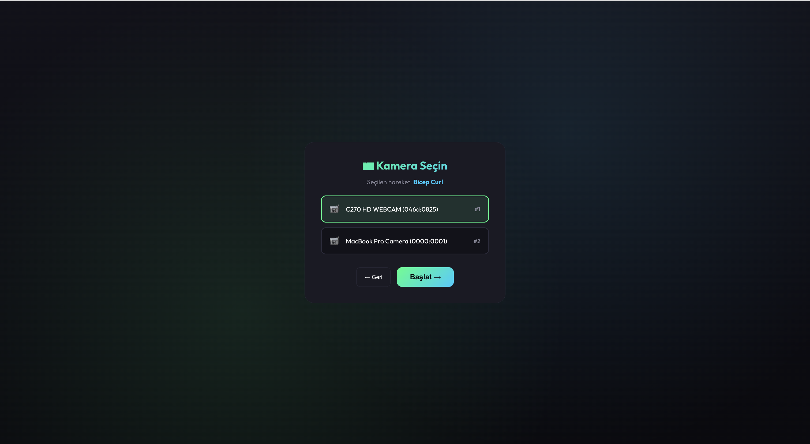
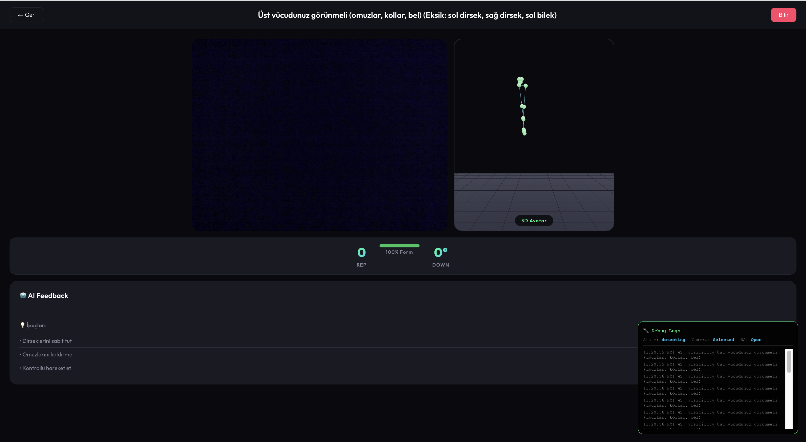
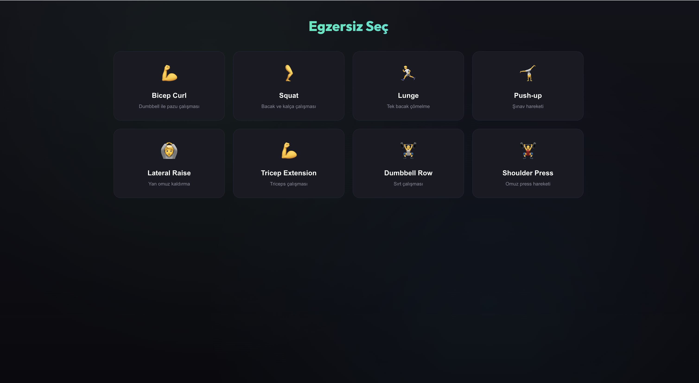

# 🏋️ Fitness AI Coach

> Real-time exercise tracking, form analysis, and AI-powered coaching using computer vision and deep learning.

[](https://python.org)
[](https://reactjs.org)
[](https://fastapi.tiangolo.com)
[](https://mediapipe.dev)
[](https://threejs.org)
[](LICENSE)

<p align="center">
  
</p>

## 📋 Table of Contents

- [Features](#-features)
- [Demo](#-demo)
- [Architecture](#-architecture)
- [Installation](#-installation)
- [Quick Start](#-quick-start)
- [Supported Exercises](#-supported-exercises)
- [3D Avatar System](#-3d-avatar-system)
- [Technical Details](#-technical-details)
- [Latency Analysis](#️-latency-analysis)
- [API Reference](#-api-reference)
- [Project Structure](#-project-structure)
- [Contributing](#-contributing)

## ✨ Features

| Feature | Description |
|---------|-------------|
| 🎯 **8 Exercise Types** | Bicep Curls, Squats, Lunges, Push-ups, Lateral Raises, Tricep Extensions, Dumbbell Rows, Shoulder Press |
| 📹 **Real-time Pose Detection** | 33 body landmarks using MediaPipe Pose |
| 📐 **Bone-Based Form Analysis** | Skeletal geometry analysis with relative body proportions |
| 🔢 **Smart Rep Counting** | Exercise-specific motion validation and counting |
| 🤖 **AI Coaching** | OpenAI-powered personalized feedback after each rep and session summary |
| 📊 **Vector Similarity Search** | FAISS-based exercise embedding comparison |
| 🎨 **Modern UI** | React + Framer Motion with dark theme |
| 👤 **3D Avatar** | Ready Player Me humanoid models with delta-based animation |
| 📷 **Multi-Camera Support** | Select from available cameras by name |
| 🛠️ **Dev Mode** | Avatar testing mode without rep/form tracking |
| 🐛 **Debug Panel** | Real-time logging for development |

## 🎬 Demo

<p align="center">
  
  
</p>

<p align="center">
  
</p>

## 🏗️ Architecture

### System Overview

```
┌─────────────────────────────────────────────────────────────────────────┐
│                         React Frontend (Vite)                           │
│  ┌─────────────┐  ┌─────────────┐  ┌─────────────┐  ┌─────────────┐   │
│  │  MediaPipe  │  │   Camera    │  │  3D Avatar  │  │   Modern    │   │
│  │    Pose     │  │  Selection  │  │  (Three.js) │  │     UI      │   │
│  └──────┬──────┘  └─────────────┘  └─────────────┘  └─────────────┘   │
│         │ 33 Landmarks                                                  │
└─────────┼───────────────────────────────────────────────────────────────┘
          │ WebSocket (ws://localhost:8000)
          ▼
┌─────────────────────────────────────────────────────────────────────────┐
│                      Python Backend (FastAPI)                           │
│  ┌─────────────┐  ┌─────────────┐  ┌─────────────┐  ┌─────────────┐   │
│  │    Form     │  │     Rep     │  │   OpenAI    │  │   Vector    │   │
│  │  Analyzer   │  │   Counter   │  │ Integration │  │  Database   │   │
│  └──────┬──────┘  └──────┬──────┘  └──────┬──────┘  └──────┬──────┘   │
│         │                │                │                │           │
│         └────────────────┴────────────────┴────────────────┘           │
│                              Bone-Based Analysis                        │
└─────────────────────────────────────────────────────────────────────────┘
```

### Data Flow Pipeline

```
Camera → MediaPipe Pose → Landmarks → WebSocket → Backend Processing
                                                        │
                    ┌───────────────────────────────────┤
                    │                                   │
                    ▼                                   ▼
            ┌─────────────┐                     ┌─────────────┐
            │ Calibration │                     │    Form     │
            │   (1 sec)   │                     │   Analysis  │
            └──────┬──────┘                     └──────┬──────┘
                   │                                   │
                   ▼                                   ▼
            ┌─────────────┐                     ┌─────────────┐
            │    Body     │                     │    Bone     │
            │ Proportions │──────────────────▶│   Angles    │
            └─────────────┘                     └──────┬──────┘
                                                       │
                    ┌──────────────────────────────────┤
                    │                                  │
                    ▼                                  ▼
            ┌─────────────┐                     ┌─────────────┐
            │     Rep     │                     │    Form     │
            │   Counting  │                     │    Score    │
            └──────┬──────┘                     └──────┬──────┘
                   │                                   │
                   └───────────────┬───────────────────┘
                                   ▼
                           ┌─────────────┐
                           │   OpenAI    │
                           │  Feedback   │
                           └──────┬──────┘
                                  │
                                  ▼
                           ┌─────────────┐
                           │  Frontend   │
                           │   Update    │
                           └─────────────┘
```

## 🛠️ Installation

### Prerequisites

- Python 3.10+
- Node.js 18+
- OpenAI API Key (optional, for AI feedback)

### 1. Clone Repository

```bash
git clone https://github.com/yourusername/fitness-ai-coach.git
cd fitness-ai-coach
```

### 2. Install Python Dependencies

```bash
pip install -r requirements.txt
```

### 3. Install Frontend Dependencies

```bash
cd frontend
npm install
cd ..
```

### 4. Configure Environment (Optional)

```bash
# Create .env file in frontend directory
cp frontend/.env.example frontend/.env
# Edit frontend/.env and add your OpenAI API key
```

## 🚀 Quick Start

### Start Backend Server

```bash
python api_server.py
# Server running at http://localhost:8000
```

### Start Frontend (New Terminal)

```bash
cd frontend
npm run dev
# Frontend running at http://localhost:5173
```

### Open in Browser

Navigate to http://localhost:5173 and start your workout!

## 💪 Supported Exercises

| Exercise | Rep Detection | Form Checks | Bones Used |
|----------|--------------|-------------|------------|
| **Bicep Curls** | Elbow angle: 70°-140° | Upper arm vertical, elbow stability, shoulder rise | `upper_arm`, `forearm` |
| **Squats** | Thigh angle from horizontal | Shin angle, torso lean, knee tracking | `thigh`, `shin`, `torso` |
| **Lunges** | Front thigh angle | Shin vertical, torso upright, hip level | `thigh`, `shin`, `hips` |
| **Push-ups** | Elbow angle: 100°-160° | Body line, elbow flare, head position | `upper_arm`, `forearm`, `torso` |
| **Lateral Raises** | Upper arm from vertical: 25°-70° | Arm symmetry, elbow bend, shoulder shrug | `upper_arm`, `shoulders` |
| **Tricep Extensions** | Elbow angle: 80°-150° | Upper arm vertical, elbow stability | `upper_arm`, `forearm` |
| **Dumbbell Rows** | Elbow angle: 90°-150° | Torso angle, shoulder rotation | `upper_arm`, `forearm`, `torso` |
| **Shoulder Press** | Elbow angle: 100°-160° | Arm symmetry, torso stability | `upper_arm`, `forearm` |
| **🛠️ Dev Mode** | Disabled | Disabled | Face & hands only |

## 👤 3D Avatar System

### Avatar Selection

Choose between two Ready Player Me avatars:
- **Emma** (Female) - `avatar-female.glb`
- **Alex** (Male) - `avatar-male.glb`

### Delta-Based Animation

The avatar uses **calibration-relative movement** for accurate pose mirroring:

```
┌─────────────────────────────────────────────────────────────┐
│                    CALIBRATION PHASE                        │
│  1. User stands still for 20 frames                         │
│  2. System captures REST POSE (initial positions)           │
│  3. Body proportions stored as reference                    │
└─────────────────────────────────────────────────────────────┘
                              │
                              ▼
┌─────────────────────────────────────────────────────────────┐
│                    ANIMATION PHASE                          │
│  For each joint:                                            │
│    delta = current_position - rest_position                 │
│    avatar_rotation = delta * sensitivity                    │
│                                                             │
│  Benefits:                                                  │
│    ✅ No floating avatar (feet on ground)                  │
│    ✅ Accurate mirroring (user left → avatar right)        │
│    ✅ Relative movements (not absolute positions)          │
│    ✅ Works regardless of camera angle                     │
└─────────────────────────────────────────────────────────────┘
```

### Avatar Features

| Feature | Description |
|---------|-------------|
| **T-Pose Until Calibrated** | Avatar stays in neutral pose until backend calibration completes |
| **Smoothed Animation** | Low-pass filter (0.4) reduces jitter |
| **Mirror Effect** | User's left arm controls avatar's right arm |
| **Upper Body Focus** | Legs remain static for upper body exercises |
| **Head Tracking** | Horizontal head rotation follows user |
| **Torso Twist** | Spine rotates with shoulder movement |

### Dev Mode

Special mode for avatar testing:
- Only detects **face and hands** (5 landmarks)
- **No rep counting** or form analysis
- **No AI feedback**
- Perfect for debugging avatar animation

## 🔬 Technical Details

### Bone-Based Analysis System

The system uses skeletal geometry rather than absolute positions for robust form analysis:

```python
# Key Bones Definition
BONES = {
    'left_upper_arm': (11, 13),   # Shoulder → Elbow
    'left_forearm': (13, 15),     # Elbow → Wrist
    'left_thigh': (23, 25),       # Hip → Knee
    'left_shin': (25, 27),        # Knee → Ankle
    'shoulders': (11, 12),        # Shoulder line
    'hips': (23, 24),             # Hip line
    'left_torso': (11, 23),       # Shoulder → Hip
}
```

### Bone Analysis Functions

| Function | Description | Use Case |
|----------|-------------|----------|
| `get_bone_vector()` | Returns bone direction vector | Movement direction |
| `get_bone_length()` | Returns bone length | Body proportion |
| `get_bone_angle_from_vertical()` | Angle from vertical axis | Arm/leg raise detection |
| `get_bone_angle_from_horizontal()` | Angle from horizontal axis | Squat depth |
| `get_angle_between_bones()` | Angle between two connected bones | Joint angles |

### Calibration System

```
1. Body Detection → Check required landmarks visible
2. Exercise-Specific Check:
   - Bicep Curls: Upper body visible
   - Squats/Lunges: Full body visible
   - Dev Mode: Face and hands only
3. Calibration (1 sec) → Record body proportions:
   - Shoulder width
   - Hip width
   - Torso height
   - Arm lengths (upper arm, forearm)
   - Leg lengths (thigh, shin)
   - Initial joint positions
4. Timeout Protection: Resets after 5 seconds if incomplete
5. Ready → Start tracking with relative measurements
```

### Form Scoring

```
Score Calculation:
├── 100: Perfect form (no issues)
├── 85-99: Minor issues
├── 60-84: Moderate issues
├── 40-59: Significant issues
└── 0-39: Critical issues (e.g., elbow above shoulder)
```

## ⏱️ Latency Analysis

### End-to-End Pipeline

```
┌─────────┐   ┌─────────┐   ┌─────────┐   ┌─────────┐   ┌─────────┐
│ Camera  │──▶│MediaPipe│──▶│WebSocket│──▶│ Backend │──▶│   UI    │
│ Capture │   │  Pose   │   │  Send   │   │ Process │   │ Update  │
└─────────┘   └─────────┘   └─────────┘   └─────────┘   └─────────┘
   16ms         30-50ms        1-5ms        5-20ms        16ms
```

### Latency Budget

| Component | Typical | Max | Notes |
|-----------|---------|-----|-------|
| Camera Capture | 16ms | 33ms | 30-60 FPS |
| MediaPipe Pose | 30-50ms | 100ms | Model complexity 1 |
| WebSocket RTT | 2-4ms | 10ms | Localhost |
| Form Analysis | 3-5ms | 10ms | Bone calculations |
| Rep Counting | 1ms | 2ms | State machine |
| UI Render | 16ms | 33ms | React + Three.js |
| **Total** | **70-110ms** | **190ms** | Real-time ✅ |

### Performance Targets

| Metric | Target | Achieved | Status |
|--------|--------|----------|--------|
| Frame-to-Feedback | < 150ms | 70-110ms | ✅ |
| Pose Detection FPS | ≥ 20 | 25-35 | ✅ |
| Form Update Rate | ≥ 15 Hz | 25-35 Hz | ✅ |
| Rep Feedback | < 1s | 400-800ms | ✅ |

### Bottlenecks & Mitigations

| Bottleneck | Impact | Mitigation |
|------------|--------|------------|
| MediaPipe Inference | 30-50ms/frame | Use `modelComplexity: 0` for low-end devices |
| OpenAI API | 400-1500ms | Async calls, non-blocking |
| Remote WebSocket | +20-100ms | Edge deployment recommended |

> 📄 See [docs/LATENCY_ANALYSIS.md](docs/LATENCY_ANALYSIS.md) for detailed analysis.

## 📡 API Reference

### WebSocket Endpoint

```
ws://localhost:8000/ws/{exercise_type}
```

**Supported exercise types:**
- `bicep_curls`, `squats`, `lunges`, `pushups`
- `lateral_shoulder_raises`, `tricep_extensions`
- `dumbbell_rows`, `dumbbell_shoulder_press`
- `dev_mode` (avatar testing only)

### Messages

#### Client → Server

```javascript
// Initialize session
{ "type": "init", "api_key": "sk-..." }

// Send pose data
{ "type": "pose", "landmarks": [...] }

// End session
{ "type": "end_session" }
```

#### Server → Client

```javascript
// State changes
{ "type": "state", "state": "detecting" | "calibrating" | "ready" | "tracking" }

// Visibility feedback
{ "type": "visibility", "message": "Face and hands must be visible", "missing": "left wrist" }

// Calibration progress
{ "type": "calibration_progress", "progress": 0.5 }

// Calibration timeout
{ "type": "calibration_timeout" }

// Tracking update
{
  "type": "update",
  "angle": 85.2,
  "phase": "up" | "down",
  "rep_count": 5,
  "form_score": 72.5,
  "issues": ["Left elbow drifting"],
  "feedback": "Great job! Keep your elbow steady."
}

// Session summary
{
  "type": "session_summary",
  "total_reps": 12,
  "avg_form": 78.5,
  "feedback": "Excellent workout! Focus on..."
}
```

### REST Endpoints

```
GET /     → Health check
```

## 📁 Project Structure

```
fitness-ai-coach/
│
├── 📄 api_server.py              # FastAPI WebSocket server
├── 📄 realtime_exercise.py       # Standalone Python tracker
├── 📄 build_exercise_db.py       # Vector database builder
├── 📄 query_exercise.py          # Similarity search
├── 📄 requirements.txt           # Python dependencies
├── 📄 .gitignore                 # Git ignore rules
│
├── 📁 exercise_embeddings/       # Embedding pipeline
│   ├── config.py                 # Exercise configurations
│   ├── data_loader.py            # MM-Fit data loader
│   ├── joint_mapping.py          # MediaPipe ↔ MM-Fit mapping
│   ├── feature_extractor.py      # Kinematic features
│   ├── embedding_generator.py    # Vector generation
│   ├── vector_db.py              # FAISS wrapper
│   └── pipeline.py               # Main pipeline
│
├── 📁 exercise_pipeline/         # Saved models & indexes
│   ├── generator.pkl
│   └── vector_db/
│       ├── bicep_curls.index
│       ├── squats.index
│       └── ...
│
├── 📁 frontend/                  # React application
│   ├── 📁 public/
│   │   └── 📁 models/            # 3D avatar models
│   │       ├── avatar-female.glb # Emma (Ready Player Me)
│   │       └── avatar-male.glb   # Alex (Ready Player Me)
│   ├── 📁 src/
│   │   ├── App.tsx               # Main app with avatar selection
│   │   ├── App.css               # Styles
│   │   ├── types.ts              # TypeScript types
│   │   ├── 📁 components/
│   │   │   ├── ExerciseSelector.tsx
│   │   │   ├── WorkoutSession.tsx
│   │   │   └── HumanAvatar.tsx   # Three.js avatar renderer
│   │   ├── 📁 config/
│   │   │   └── exercises.ts      # Exercise configs
│   │   └── 📁 services/
│   │       └── openai.ts         # AI feedback service
│   ├── .env                      # Environment variables (gitignored)
│   ├── .env.example              # Environment template
│   └── package.json
│
├── 📁 docs/
│   └── LATENCY_ANALYSIS.md       # Detailed performance analysis
│
├── 📁 mm-fit/                    # MM-Fit dataset
│
└── 📁 assets/                    # Screenshots & media
    ├── demo-1.png
    ├── demo-2.png
    ├── demo-3.png
    └── demo-avatar.png
```

## 📊 Vector Database

Pre-built embeddings from MM-Fit dataset:

| Exercise | Embeddings | Features |
|----------|------------|----------|
| Bicep Curls | 56 | Angles, ROM, velocity, smoothness |
| Squats | 78 | |
| Lunges | 64 | |
| Push-ups | 52 | |
| Lateral Raises | 48 | |
| Tricep Extensions | 62 | |
| Dumbbell Rows | 58 | |
| Shoulder Press | 76 | |
| **Total** | **494** | |

### Similarity Search

```python
from exercise_embeddings import ExerciseEmbeddingPipeline

# Load pipeline
pipeline = ExerciseEmbeddingPipeline.load("exercise_pipeline")

# Query similar exercises
results = pipeline.query("bicep_curls", embedding, k=5)
# Returns: [(similarity_score, exercise_data), ...]
```

## 🧪 Testing

### Backend Health Check

```bash
curl http://localhost:8000/
# {"message": "Fitness AI Coach API", "status": "running"}
```

### WebSocket Test

```python
import asyncio
import websockets
import json

async def test():
    async with websockets.connect("ws://localhost:8000/ws/bicep_curls") as ws:
        await ws.send(json.dumps({"type": "init"}))
        response = await ws.recv()
        print(json.loads(response))

asyncio.run(test())
```

### Dev Mode Testing

1. Open http://localhost:5173
2. Select **🛠️ Dev Mode** from exercise list
3. Select camera and avatar
4. Only face and hands need to be visible
5. Avatar follows your movements without tracking stats

## 🤝 Contributing

1. Fork the repository
2. Create your feature branch (`git checkout -b feature/AmazingFeature`)
3. Commit your changes (`git commit -m 'Add some AmazingFeature'`)
4. Push to the branch (`git push origin feature/AmazingFeature`)
5. Open a Pull Request

## 📝 License

This project is licensed under the MIT License - see the [LICENSE](LICENSE) file for details.

## 🙏 Acknowledgments

- [MediaPipe](https://mediapipe.dev/) for pose estimation
- [MM-Fit Dataset](https://github.com/mmic-lab/mm-fit) for training data
- [OpenAI](https://openai.com/) for AI feedback generation
- [FAISS](https://github.com/facebookresearch/faiss) for vector similarity search
- [Ready Player Me](https://readyplayer.me/) for 3D avatar models
- [Three.js](https://threejs.org/) for 3D rendering

---

<p align="center">
  Made with 💪 by the Fitness AI Team
</p>
